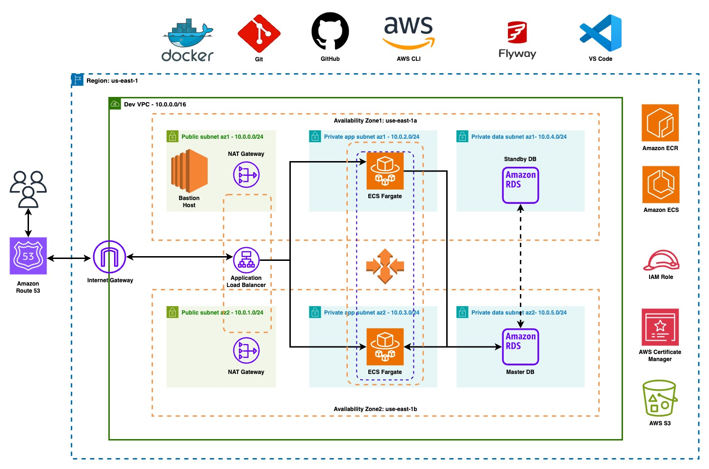

# DevOps Project: Dynamic Web Application with Docker on AWS

This project showcases the deployment of a dynamic web application using Docker containers on the AWS cloud. The objective is to provide a comprehensive guide for setting up, building, and deploying a containerized web application using various AWS services. The project incorporates GitHub for version control, Docker Hub for image storage, Flyway for database migration, and a wide array of AWS services for hosting and managing the application.

## Summary

The project encompasses the following key steps:

1. **GitHub Repository Setup:**
   - Establish a GitHub repository to house the Dockerfile and related scripts.
   - Clone the repository to your local machine for development and tracking changes.

2. **Docker and Docker Hub:**
   - Register for a Docker Hub account.
   - Download and install Docker on your computer.
   - Develop a Dockerfile for constructing the container image.
   - Build, initiate, and push the Docker image to Docker Hub for version control.

3. **AWS Infrastructure:**
   - Install AWS CLI, create an IAM User, and configure a named profile.
   - Set up an Amazon ECR Repository for storing Docker images securely.
   - Configure a 3-tier VPC with public and private subnets, including essential resources like Nat Gateways, Bastion Host, and Application Load Balancer.
   - Establish Security Groups, an ECS Cluster, and a Task Definition for container orchestration.
   - Employ an Application Load Balancer to efficiently distribute web traffic to ECS Fargate tasks.

4. **Database Migration with Flyway:**
   - Utilize Flyway for seamless migration of SQL data into the Amazon RDS database.

5. **Additional AWS Services:**
   - Leverage Route 53 for domain registration and the creation of DNS records.
   - Implement AWS Certificate Manager to enhance security with SSL/TLS encryption for data in transit.

6. **Scripts in VS Code:**
   - A collection of scripts for tasks such as building, managing, and pushing Docker images to repositories on Docker Hub and AWS ECR.

## Deployment Script (Mac PC):
```
ssh -i <ec2-key-pair> -L <rds-port>:<rds-endpoint>:<localhost-port> ec2-user@<ec2-public-ip> -N -f
```
